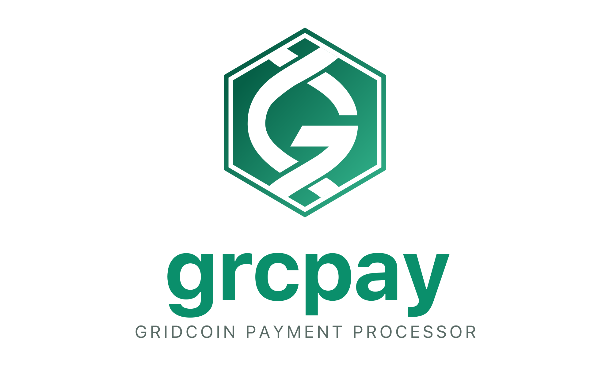

<p align="center">
  
</p>

# grcpay-woocommerce

WooCommerce payment gateway plugin for Gridcoin (GRC), powered by [grcpay](https://grcpay.gridcoin.club).

This package is the **standalone, distributable WordPress plugin**. The plugin
source lives in `plugin/` and is the only thing that ships to WordPress sites —
the package root just holds development and release tooling.

## Layout

```
grcpay-woocommerce/
├── plugin/                          # what ships to WP (matches the .zip contents)
│   ├── grcpay-woocommerce.php       #   main plugin entry (header + loader)
│   ├── define.php                   #   constants
│   ├── controllers/Gateway.php      #   WC_Grcpay_Gateway (payment handler)
│   ├── utils/helper.php             #   grcpay API wrapper
│   ├── static/                      #   JS, CSS, icons
│   ├── emails/                      #   email templates
│   ├── languages/                   #   i18n (.pot stub; regenerate via wp i18n make-pot)
│   ├── README.md                    #   end-user readme
│   └── readme.txt                   #   WP.org-style readme
├── scripts/build-zip.sh             # produce dist/grcpay-woocommerce.zip
├── package.json                     # nx-aware package metadata + scripts
└── README.md                        # (this file)
```

## Develop

The plugin is PHP — there is no compile step. Edit files under `plugin/` and
they are picked up live by the demo shop (`grcpay-woocommerce-demo`), which
bind-mounts `plugin/` into `/var/www/html/wp-content/plugins/grcpay-woocommerce/`.
A browser refresh is enough — you do **not** need to restart the demo
container to pick up plugin changes.

```bash
# Start the whole stack (grcpay API, wallet, demo shop, ...)
cd ../../../grc-infra && docker compose up
```

Then visit:

- Demo shop (customer view): http://localhost:8000
- Demo shop admin:            http://localhost:8000/wp-admin (demo / demo)
- grcpay API:                 http://localhost:7001

The demo shop is intentionally ephemeral: restarting it wipes the WordPress
database and reprovisions from scratch, so demo orders and signups never
accumulate. See the demo package's README for details.

## Build a distributable .zip

```bash
npm run build
```

Produces `dist/grcpay-woocommerce.zip` containing a top-level
`grcpay-woocommerce/` directory — drop this straight into WordPress's
**Plugins → Add New → Upload Plugin** screen.

## Running tests

The plugin ships with a PHPUnit unit suite covering the
security-critical helpers (URL classifier for the plaintext-HTTP
refusal, per-order nonce scope for the AJAX poll, invoice rounding,
halford conversion, protected-meta filter, fallback URL list
construction). It uses **Brain Monkey** to stub the WordPress globals
so the suite runs in isolation — **no WordPress, no WooCommerce, no
mysql, no grcpay daemon, no demo stack required.**

### Locally

The only prerequisite is Docker. The `scripts/test.sh` wrapper runs
everything inside an ephemeral `composer:2` container, which ships
with PHP 8.3 and Composer preinstalled:

```bash
npm test                  # or: ./scripts/test.sh
npm run test:coverage     # or: ./scripts/test.sh test:coverage
npm run test:install      # force-reinstall vendor/ from composer.lock
```

First run auto-installs `vendor/` from `composer.lock`. Subsequent
runs reuse the cached `vendor/` for fast test loops (4ms wall time
for the full suite). `vendor/` and `.phpunit.result.cache` are
gitignored.

If you prefer running PHPUnit directly without the wrapper — for
example because you already have PHP + Composer installed locally —
`composer install && composer test` from this directory works the
same way.

### In CI

The CircleCI pipeline has a dedicated `grcpay-woocommerce-checks`
job that runs on the `cimg/php:8.3` image, decoupled from the
Nx-affected detection the Node packages use. It does a fresh
checkout, restores the Composer cache by `composer.lock` checksum
(same caching pattern the Node jobs use for `package-lock.json`),
installs, and runs `composer test`. See `.circleci/config.yml` at
the monorepo root for the full job.

### How the tests stay lightweight

`tests/bootstrap.php` declares a minimal `WC_Payment_Gateway` stub
and polyfills `__()`, `esc_html()`, `wp_parse_url()`, and a few
other WP globals, so `WC_Grcpay_Gateway` can be instantiated and
reflected on without loading WordPress or WooCommerce. Tests that
need richer WP behaviour (hooks firing, option storage, nonce
verification, user capabilities) should layer Brain Monkey's
`setUp`/`tearDown` pattern on top in the individual test class —
see the existing tests as a template.

The suite is deliberately unit-level only. Integration testing
against a real WooCommerce stack lives in the separate
`grcpay-woocommerce-demo` package, which is a full WP + WC install
you can exercise end-to-end in a browser.

## Status

The plugin is at v1.0.0 and tracks the current grcpay API. The user-facing
docs site copy lives at
`packages/grcpay-frontend/src/routes/integrations/woocommerce/`
and should stay in sync with the install/configure flow described in
`plugin/README.md` and `plugin/readme.txt`.
